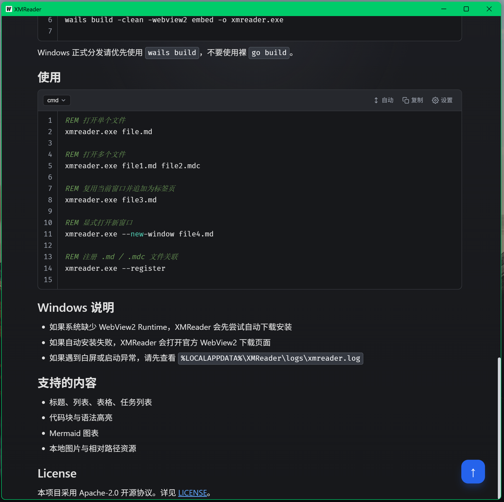
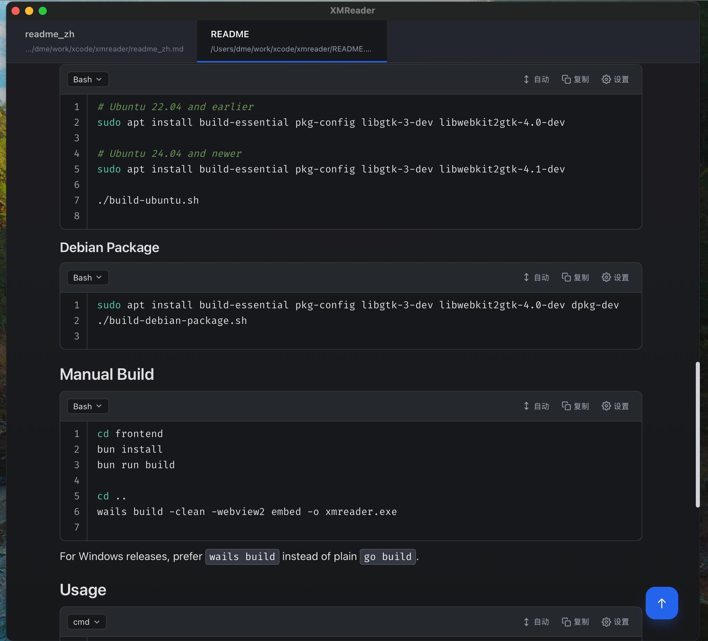

# XMReader

[简体中文](./readme_zh.md)

XMReader is a lightweight, cross-platform Markdown reader built with Go, Wails, and Vue, focused on a clean local-document reading experience.

## Overview

- Designed for local Markdown reading without forcing a full editor workflow
- Supports multi-tab reading, drag-and-drop opening, Mermaid diagrams, local image resolution, and both `.md` and `.mdc` files
- Includes WebView2 runtime detection, automatic installation fallback, and startup logs on Windows

## Screenshots

### Windows



### macOS



## Features

- Multi-tab reading for multiple files
- Markdown and GitHub Flavored Markdown rendering
- Source and config file reading through fenced code block rendering, including `.go`, `.py`, `.js`, `.ts`, `.tsx`, `.java`, `.rs`, `.c`, `.cpp`, `.cs`, `.kt`, `.swift`, `.php`, `.rb`, `.sh`, `.bat`, `.cmd`, `.ps1`, `.psm1`, `.psd1`, `.json`, `.yaml`, `.toml`, `.xml`, `.html`, `.css`, `.scss`, `.sql`, and more
- Vue SFC files such as `.vue` are rendered as structured Markdown sections (`template` / `script` / `style`)
- Mermaid diagram rendering
- Local image and relative-path image resolution
- Drag-and-drop file opening
- Support for both `.md` and `.mdc` files
- System light and dark theme support
- Windows WebView2 dependency self-check and recovery

## Tech Stack

- Go + Wails v2
- Vue 3 + TypeScript
- Vite
- TipTap / BlockEditor
- Mermaid

## Requirements

- Go 1.22+
- bun
- Wails CLI v2  
  `go install github.com/wailsapp/wails/v2/cmd/wails@latest`

## Build

### Windows

```cmd
REM Build the production executable
build.bat

REM Build the NSIS installer (requires NSIS / makensis)
build-installer.bat
```

- The production executable is generated at `build/bin/xmreader.exe`
- XMReader depends on Microsoft WebView2 Runtime on Windows
- Startup logs are written to `%LOCALAPPDATA%\XMReader\logs\xmreader.log`

### macOS

```bash
./build-macos.sh
```

- Builds the `.app` bundle
- Generates a `.dmg` when available

### Ubuntu

```bash
# Ubuntu 22.04 and earlier
sudo apt install build-essential pkg-config libgtk-3-dev libwebkit2gtk-4.0-dev

# Ubuntu 24.04 and newer
sudo apt install build-essential pkg-config libgtk-3-dev libwebkit2gtk-4.1-dev

./build-ubuntu.sh
```

### Debian Package

```bash
sudo apt install build-essential pkg-config libgtk-3-dev libwebkit2gtk-4.0-dev dpkg-dev
./build-debian-package.sh
```

## Manual Build

```bash
cd frontend
bun install
bun run build

cd ..
go run ./scripts/buildassets
wails build -clean -webview2 embed -o xmreader.exe
```

For Windows releases, prefer `wails build` instead of plain `go build`.
`assets/appicon.png` is the canonical application icon. The preparation command copies it to the location expected by Wails and removes stale generated Windows icons before packaging.

## GitHub Release Automation

- Pushing a new tag automatically triggers `.github/workflows/release.yml`
- Version tags must follow [VERSIONING_RULES.mdc](./VERSIONING_RULES.mdc): `v{yy}.{MMdd}.{HHmm}`
- Example: `v26.0411.1735`
- The workflow syncs `wails.json -> info.productVersion` from the tag version during CI, so app metadata and the Debian package version stay aligned with the Release
- Published release assets currently include:
  - `XMReader-<tag>-windows-amd64.zip`
  - `XMReader-<tag>-macos-universal.zip`
  - `XMReader-<tag>-macos-universal.dmg`
  - `XMReader-<tag>-linux-amd64.tar.gz`
  - `XMReader-<tag>-linux-amd64.deb`
  - `SHA256SUMS.txt`

## Usage

```cmd
REM Open one file
xmreader.exe file.md

REM Open a Go source file
xmreader.exe main.go

REM Open other supported source/config files
xmreader.exe script.py
xmreader.exe config.json

REM Open Windows script files
xmreader.exe build.bat
xmreader.exe build.ps1

REM Open multiple files
xmreader.exe file1.md file2.mdc

REM Reuse the existing window and append as tabs
xmreader.exe file3.md

REM Explicitly open a new window
xmreader.exe --new-window file4.md

REM Register file associations for .md / .mdc
xmreader.exe --register
```

## Windows Notes

- If WebView2 Runtime is missing, XMReader will try to download and install it automatically
- If automatic installation fails, XMReader opens the official WebView2 download page
- If you see a blank window or startup issues, check `%LOCALAPPDATA%\XMReader\logs\xmreader.log` first

## Supported Content

- Headings, lists, tables, and task lists
- Code blocks and syntax highlighting
- Mermaid diagrams
- Local images and relative-path assets

## License

Licensed under the Apache-2.0 License. See [LICENSE](./LICENSE) for details.

## Third-Party Notices

XMReader uses third-party software. The following summary is intended for attribution and compliance reference and focuses on major direct dependencies, build-time components, and externally required runtime components.

Unless otherwise stated, the listed open-source components remain under their own upstream licenses and copyrights.

The versions below reflect the audited workspace state at the time this README was updated.

### Direct / Bundled Open-Source Components

| Component | Version | Classification | License | Scope / Purpose |
| --- | --- | --- | --- | --- |
| Wails | `v2.12.0` | Open source | MIT | Desktop application framework used by the Go host application |
| `go-webview2` | `v1.0.22` | Open source | MIT | Windows WebView2 loader / binding used by XMReader bootstrap logic |
| `golang.org/x/sys` | `v0.30.0` | Open source | BSD-3-Clause | Windows registry and low-level OS integration |
| Vue | `3.5.32` | Open source | MIT | Frontend UI framework |
| TipTap package family (`@tiptap/core`, `@tiptap/*`, `@tiptap/pm`) | `3.22.3` | Open source | MIT | Block-based rich text / Markdown reader editing foundation |
| Marked | `12.0.2` | Open source | MIT | Markdown parsing |
| Mermaid | `11.14.0` | Open source | MIT | Diagram rendering |
| Lowlight | `3.3.0` | Open source | MIT | Syntax highlighting adapter |
| Highlight.js | `11.11.1` | Open source | BSD-3-Clause | Code syntax highlighting |

### Build-Time Open-Source Components

| Component | Version | Classification | License | Scope / Purpose |
| --- | --- | --- | --- | --- |
| Vite | `5.4.21` | Open source | MIT | Frontend build tool |
| `@vitejs/plugin-vue` | `5.2.4` | Open source | MIT | Vue SFC support in Vite |
| TypeScript | `5.9.3` | Open source | Apache-2.0 | Type checking and compilation |
| `vue-tsc` | `2.2.12` | Open source | MIT | Vue TypeScript checking |
| NSIS / `makensis` | External tool | Open source | zlib/libpng | Optional Windows installer generation; required only when running `build-installer.bat` |

### Proprietary / Closed-Source External Components

| Component | Version | Classification | License / Terms | Scope / Purpose |
| --- | --- | --- | --- | --- |
| Microsoft Edge WebView2 Runtime | External runtime | Proprietary / closed source | Microsoft WebView2 Runtime Terms and Conditions License | Required on Windows for rendering the application WebView; XMReader may detect, download, or invoke installation of this runtime |

### Compliance Notes

- This summary focuses on major direct dependencies and externally required components. It is not a complete replacement for reviewing all transitive dependencies recorded in `go.mod`, `go.sum`, `frontend/package.json`, and `frontend/bun.lock`.
- Windows builds may prompt for, download, or install Microsoft Edge WebView2 Runtime. That runtime and its installer are governed by Microsoft terms, not by Apache-2.0 or the open-source licenses listed above.
- macOS and Linux builds also rely on system-provided webview stacks supplied by the operating system or Linux distribution. Those system components are not bundled by this repository and remain subject to their own vendor / distribution licenses.
